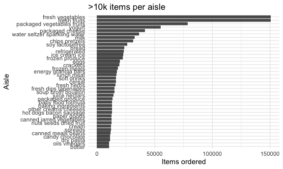
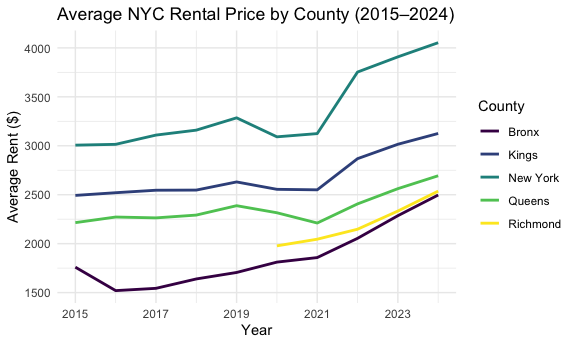
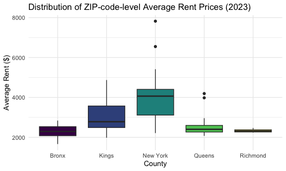
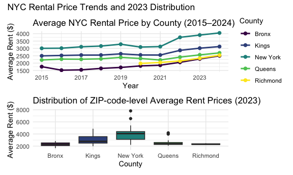

p8105_hw3_cw3747
================
chuhan wang_cw3747
2025-10-05

``` r
library(tidyverse)
```

    ## ── Attaching core tidyverse packages ──────────────────────── tidyverse 2.0.0 ──
    ## ✔ dplyr     1.1.4     ✔ readr     2.1.5
    ## ✔ forcats   1.0.0     ✔ stringr   1.5.1
    ## ✔ ggplot2   3.5.2     ✔ tibble    3.3.0
    ## ✔ lubridate 1.9.4     ✔ tidyr     1.3.1
    ## ✔ purrr     1.1.0     
    ## ── Conflicts ────────────────────────────────────────── tidyverse_conflicts() ──
    ## ✖ dplyr::filter() masks stats::filter()
    ## ✖ dplyr::lag()    masks stats::lag()
    ## ℹ Use the conflicted package (<http://conflicted.r-lib.org/>) to force all conflicts to become errors

``` r
library(patchwork)
library(scales)
```

    ## 
    ## Attaching package: 'scales'
    ## 
    ## The following object is masked from 'package:purrr':
    ## 
    ##     discard
    ## 
    ## The following object is masked from 'package:readr':
    ## 
    ##     col_factor

``` r
knitr::opts_chunk$set(
  fig.width = 6,
  fig.asp = .6,
  out.width = "90%"
)

theme_set(theme_minimal() + theme(legend.position = "bottom"))

options(
  ggplot2.continuous.colour = "viridis",
  ggplot2.continuous.fill = "viridis"
)

scale_colour_discrete = scale_colour_viridis_d
scale_fill_discrete = scale_fill_viridis_d
```

## Problem1

### 1.1

``` r
library(p8105.datasets)
data("instacart")
```

``` r
instacart <- instacart |>
  janitor::clean_names() 

n_aisles <- n_distinct(instacart$aisle)    ## calculate aisles

aisle_counts <- instacart |>
  count(aisle, name = "n_items") |>       ## count the number of each item
  arrange(desc(n_items))   ## top aisles

n_aisles
```

    ## [1] 134

``` r
head(aisle_counts, 10)
```

    ## # A tibble: 10 × 2
    ##    aisle                         n_items
    ##    <chr>                           <int>
    ##  1 fresh vegetables               150609
    ##  2 fresh fruits                   150473
    ##  3 packaged vegetables fruits      78493
    ##  4 yogurt                          55240
    ##  5 packaged cheese                 41699
    ##  6 water seltzer sparkling water   36617
    ##  7 milk                            32644
    ##  8 chips pretzels                  31269
    ##  9 soy lactosefree                 26240
    ## 10 bread                           23635

There are **134** aisles in the instacart dataset, and the most orderd
items are **fresh vegetables, fresh fruits, packaged vegetables
fruits**.

### 1.2

``` r
aisle_counts |>
  filter(n_items > 10000) |>
  mutate(aisle = fct_reorder(aisle, n_items)) |>
  ggplot(aes(x = aisle, y = n_items)) +
  geom_col() +
  coord_flip() +           ## for easy reading
  labs(x = "Aisle", y = "Items ordered", title = ">10k items per aisle") +
  theme_minimal()
```



### 1.3

``` r
sel_aisles <- c("baking ingredients", "dog food care", "packaged vegetables fruits")

popular_items <- instacart |>
  filter(aisle %in% sel_aisles) |>               ## keep the three aisles
  select(aisle, product_name) |>                  
  count(aisle, product_name, name = "n_orders") |>  ## keep product name and number
  group_by(aisle) |>
  slice_max(n_orders, n = 3, with_ties = FALSE) |>
  arrange(aisle, desc(n_orders)) |>
  ungroup()

popular_items
```

    ## # A tibble: 9 × 3
    ##   aisle                      product_name                               n_orders
    ##   <chr>                      <chr>                                         <int>
    ## 1 baking ingredients         Light Brown Sugar                               499
    ## 2 baking ingredients         Pure Baking Soda                                387
    ## 3 baking ingredients         Cane Sugar                                      336
    ## 4 dog food care              Snack Sticks Chicken & Rice Recipe Dog Tr…       30
    ## 5 dog food care              Organix Chicken & Brown Rice Recipe              28
    ## 6 dog food care              Small Dog Biscuits                               26
    ## 7 packaged vegetables fruits Organic Baby Spinach                           9784
    ## 8 packaged vegetables fruits Organic Raspberries                            5546
    ## 9 packaged vegetables fruits Organic Blueberries                            4966

## 1.4

``` r
library(gt)
products <- c("Pink Lady Apples", "Coffee Ice Cream")

weekday_levels <- c("Sun","Mon","Tue","Wed","Thu","Fri","Sat")    ## to make readable

mean_hour <- instacart |>
  filter(product_name %in% products) |>
  mutate(dow = factor(weekday_levels[order_dow + 1],
                    levels = weekday_levels)) |>
  group_by(product_name, dow) |>
  summarize(mean_hour = mean(order_hour_of_day, na.rm = TRUE), .groups = "drop") |>
  mutate(mean_hour = round(mean_hour, 1)) |>
  pivot_wider(names_from = dow, values_from = mean_hour) |>
  arrange(match(product_name, products))

mean_hour |>
  gt() |>
  tab_header(title = "Mean order time by weekday (hours, 24h)") |>
  cols_label(product_name = "Product")
```

<div id="zjfogqkdsb" style="padding-left:0px;padding-right:0px;padding-top:10px;padding-bottom:10px;overflow-x:auto;overflow-y:auto;width:auto;height:auto;">
<style>#zjfogqkdsb table {
  font-family: system-ui, 'Segoe UI', Roboto, Helvetica, Arial, sans-serif, 'Apple Color Emoji', 'Segoe UI Emoji', 'Segoe UI Symbol', 'Noto Color Emoji';
  -webkit-font-smoothing: antialiased;
  -moz-osx-font-smoothing: grayscale;
}
&#10;#zjfogqkdsb thead, #zjfogqkdsb tbody, #zjfogqkdsb tfoot, #zjfogqkdsb tr, #zjfogqkdsb td, #zjfogqkdsb th {
  border-style: none;
}
&#10;#zjfogqkdsb p {
  margin: 0;
  padding: 0;
}
&#10;#zjfogqkdsb .gt_table {
  display: table;
  border-collapse: collapse;
  line-height: normal;
  margin-left: auto;
  margin-right: auto;
  color: #333333;
  font-size: 16px;
  font-weight: normal;
  font-style: normal;
  background-color: #FFFFFF;
  width: auto;
  border-top-style: solid;
  border-top-width: 2px;
  border-top-color: #A8A8A8;
  border-right-style: none;
  border-right-width: 2px;
  border-right-color: #D3D3D3;
  border-bottom-style: solid;
  border-bottom-width: 2px;
  border-bottom-color: #A8A8A8;
  border-left-style: none;
  border-left-width: 2px;
  border-left-color: #D3D3D3;
}
&#10;#zjfogqkdsb .gt_caption {
  padding-top: 4px;
  padding-bottom: 4px;
}
&#10;#zjfogqkdsb .gt_title {
  color: #333333;
  font-size: 125%;
  font-weight: initial;
  padding-top: 4px;
  padding-bottom: 4px;
  padding-left: 5px;
  padding-right: 5px;
  border-bottom-color: #FFFFFF;
  border-bottom-width: 0;
}
&#10;#zjfogqkdsb .gt_subtitle {
  color: #333333;
  font-size: 85%;
  font-weight: initial;
  padding-top: 3px;
  padding-bottom: 5px;
  padding-left: 5px;
  padding-right: 5px;
  border-top-color: #FFFFFF;
  border-top-width: 0;
}
&#10;#zjfogqkdsb .gt_heading {
  background-color: #FFFFFF;
  text-align: center;
  border-bottom-color: #FFFFFF;
  border-left-style: none;
  border-left-width: 1px;
  border-left-color: #D3D3D3;
  border-right-style: none;
  border-right-width: 1px;
  border-right-color: #D3D3D3;
}
&#10;#zjfogqkdsb .gt_bottom_border {
  border-bottom-style: solid;
  border-bottom-width: 2px;
  border-bottom-color: #D3D3D3;
}
&#10;#zjfogqkdsb .gt_col_headings {
  border-top-style: solid;
  border-top-width: 2px;
  border-top-color: #D3D3D3;
  border-bottom-style: solid;
  border-bottom-width: 2px;
  border-bottom-color: #D3D3D3;
  border-left-style: none;
  border-left-width: 1px;
  border-left-color: #D3D3D3;
  border-right-style: none;
  border-right-width: 1px;
  border-right-color: #D3D3D3;
}
&#10;#zjfogqkdsb .gt_col_heading {
  color: #333333;
  background-color: #FFFFFF;
  font-size: 100%;
  font-weight: normal;
  text-transform: inherit;
  border-left-style: none;
  border-left-width: 1px;
  border-left-color: #D3D3D3;
  border-right-style: none;
  border-right-width: 1px;
  border-right-color: #D3D3D3;
  vertical-align: bottom;
  padding-top: 5px;
  padding-bottom: 6px;
  padding-left: 5px;
  padding-right: 5px;
  overflow-x: hidden;
}
&#10;#zjfogqkdsb .gt_column_spanner_outer {
  color: #333333;
  background-color: #FFFFFF;
  font-size: 100%;
  font-weight: normal;
  text-transform: inherit;
  padding-top: 0;
  padding-bottom: 0;
  padding-left: 4px;
  padding-right: 4px;
}
&#10;#zjfogqkdsb .gt_column_spanner_outer:first-child {
  padding-left: 0;
}
&#10;#zjfogqkdsb .gt_column_spanner_outer:last-child {
  padding-right: 0;
}
&#10;#zjfogqkdsb .gt_column_spanner {
  border-bottom-style: solid;
  border-bottom-width: 2px;
  border-bottom-color: #D3D3D3;
  vertical-align: bottom;
  padding-top: 5px;
  padding-bottom: 5px;
  overflow-x: hidden;
  display: inline-block;
  width: 100%;
}
&#10;#zjfogqkdsb .gt_spanner_row {
  border-bottom-style: hidden;
}
&#10;#zjfogqkdsb .gt_group_heading {
  padding-top: 8px;
  padding-bottom: 8px;
  padding-left: 5px;
  padding-right: 5px;
  color: #333333;
  background-color: #FFFFFF;
  font-size: 100%;
  font-weight: initial;
  text-transform: inherit;
  border-top-style: solid;
  border-top-width: 2px;
  border-top-color: #D3D3D3;
  border-bottom-style: solid;
  border-bottom-width: 2px;
  border-bottom-color: #D3D3D3;
  border-left-style: none;
  border-left-width: 1px;
  border-left-color: #D3D3D3;
  border-right-style: none;
  border-right-width: 1px;
  border-right-color: #D3D3D3;
  vertical-align: middle;
  text-align: left;
}
&#10;#zjfogqkdsb .gt_empty_group_heading {
  padding: 0.5px;
  color: #333333;
  background-color: #FFFFFF;
  font-size: 100%;
  font-weight: initial;
  border-top-style: solid;
  border-top-width: 2px;
  border-top-color: #D3D3D3;
  border-bottom-style: solid;
  border-bottom-width: 2px;
  border-bottom-color: #D3D3D3;
  vertical-align: middle;
}
&#10;#zjfogqkdsb .gt_from_md > :first-child {
  margin-top: 0;
}
&#10;#zjfogqkdsb .gt_from_md > :last-child {
  margin-bottom: 0;
}
&#10;#zjfogqkdsb .gt_row {
  padding-top: 8px;
  padding-bottom: 8px;
  padding-left: 5px;
  padding-right: 5px;
  margin: 10px;
  border-top-style: solid;
  border-top-width: 1px;
  border-top-color: #D3D3D3;
  border-left-style: none;
  border-left-width: 1px;
  border-left-color: #D3D3D3;
  border-right-style: none;
  border-right-width: 1px;
  border-right-color: #D3D3D3;
  vertical-align: middle;
  overflow-x: hidden;
}
&#10;#zjfogqkdsb .gt_stub {
  color: #333333;
  background-color: #FFFFFF;
  font-size: 100%;
  font-weight: initial;
  text-transform: inherit;
  border-right-style: solid;
  border-right-width: 2px;
  border-right-color: #D3D3D3;
  padding-left: 5px;
  padding-right: 5px;
}
&#10;#zjfogqkdsb .gt_stub_row_group {
  color: #333333;
  background-color: #FFFFFF;
  font-size: 100%;
  font-weight: initial;
  text-transform: inherit;
  border-right-style: solid;
  border-right-width: 2px;
  border-right-color: #D3D3D3;
  padding-left: 5px;
  padding-right: 5px;
  vertical-align: top;
}
&#10;#zjfogqkdsb .gt_row_group_first td {
  border-top-width: 2px;
}
&#10;#zjfogqkdsb .gt_row_group_first th {
  border-top-width: 2px;
}
&#10;#zjfogqkdsb .gt_summary_row {
  color: #333333;
  background-color: #FFFFFF;
  text-transform: inherit;
  padding-top: 8px;
  padding-bottom: 8px;
  padding-left: 5px;
  padding-right: 5px;
}
&#10;#zjfogqkdsb .gt_first_summary_row {
  border-top-style: solid;
  border-top-color: #D3D3D3;
}
&#10;#zjfogqkdsb .gt_first_summary_row.thick {
  border-top-width: 2px;
}
&#10;#zjfogqkdsb .gt_last_summary_row {
  padding-top: 8px;
  padding-bottom: 8px;
  padding-left: 5px;
  padding-right: 5px;
  border-bottom-style: solid;
  border-bottom-width: 2px;
  border-bottom-color: #D3D3D3;
}
&#10;#zjfogqkdsb .gt_grand_summary_row {
  color: #333333;
  background-color: #FFFFFF;
  text-transform: inherit;
  padding-top: 8px;
  padding-bottom: 8px;
  padding-left: 5px;
  padding-right: 5px;
}
&#10;#zjfogqkdsb .gt_first_grand_summary_row {
  padding-top: 8px;
  padding-bottom: 8px;
  padding-left: 5px;
  padding-right: 5px;
  border-top-style: double;
  border-top-width: 6px;
  border-top-color: #D3D3D3;
}
&#10;#zjfogqkdsb .gt_last_grand_summary_row_top {
  padding-top: 8px;
  padding-bottom: 8px;
  padding-left: 5px;
  padding-right: 5px;
  border-bottom-style: double;
  border-bottom-width: 6px;
  border-bottom-color: #D3D3D3;
}
&#10;#zjfogqkdsb .gt_striped {
  background-color: rgba(128, 128, 128, 0.05);
}
&#10;#zjfogqkdsb .gt_table_body {
  border-top-style: solid;
  border-top-width: 2px;
  border-top-color: #D3D3D3;
  border-bottom-style: solid;
  border-bottom-width: 2px;
  border-bottom-color: #D3D3D3;
}
&#10;#zjfogqkdsb .gt_footnotes {
  color: #333333;
  background-color: #FFFFFF;
  border-bottom-style: none;
  border-bottom-width: 2px;
  border-bottom-color: #D3D3D3;
  border-left-style: none;
  border-left-width: 2px;
  border-left-color: #D3D3D3;
  border-right-style: none;
  border-right-width: 2px;
  border-right-color: #D3D3D3;
}
&#10;#zjfogqkdsb .gt_footnote {
  margin: 0px;
  font-size: 90%;
  padding-top: 4px;
  padding-bottom: 4px;
  padding-left: 5px;
  padding-right: 5px;
}
&#10;#zjfogqkdsb .gt_sourcenotes {
  color: #333333;
  background-color: #FFFFFF;
  border-bottom-style: none;
  border-bottom-width: 2px;
  border-bottom-color: #D3D3D3;
  border-left-style: none;
  border-left-width: 2px;
  border-left-color: #D3D3D3;
  border-right-style: none;
  border-right-width: 2px;
  border-right-color: #D3D3D3;
}
&#10;#zjfogqkdsb .gt_sourcenote {
  font-size: 90%;
  padding-top: 4px;
  padding-bottom: 4px;
  padding-left: 5px;
  padding-right: 5px;
}
&#10;#zjfogqkdsb .gt_left {
  text-align: left;
}
&#10;#zjfogqkdsb .gt_center {
  text-align: center;
}
&#10;#zjfogqkdsb .gt_right {
  text-align: right;
  font-variant-numeric: tabular-nums;
}
&#10;#zjfogqkdsb .gt_font_normal {
  font-weight: normal;
}
&#10;#zjfogqkdsb .gt_font_bold {
  font-weight: bold;
}
&#10;#zjfogqkdsb .gt_font_italic {
  font-style: italic;
}
&#10;#zjfogqkdsb .gt_super {
  font-size: 65%;
}
&#10;#zjfogqkdsb .gt_footnote_marks {
  font-size: 75%;
  vertical-align: 0.4em;
  position: initial;
}
&#10;#zjfogqkdsb .gt_asterisk {
  font-size: 100%;
  vertical-align: 0;
}
&#10;#zjfogqkdsb .gt_indent_1 {
  text-indent: 5px;
}
&#10;#zjfogqkdsb .gt_indent_2 {
  text-indent: 10px;
}
&#10;#zjfogqkdsb .gt_indent_3 {
  text-indent: 15px;
}
&#10;#zjfogqkdsb .gt_indent_4 {
  text-indent: 20px;
}
&#10;#zjfogqkdsb .gt_indent_5 {
  text-indent: 25px;
}
&#10;#zjfogqkdsb .katex-display {
  display: inline-flex !important;
  margin-bottom: 0.75em !important;
}
&#10;#zjfogqkdsb div.Reactable > div.rt-table > div.rt-thead > div.rt-tr.rt-tr-group-header > div.rt-th-group:after {
  height: 0px !important;
}
</style>
<table class="gt_table" data-quarto-disable-processing="false" data-quarto-bootstrap="false">
  <thead>
    <tr class="gt_heading">
      <td colspan="8" class="gt_heading gt_title gt_font_normal gt_bottom_border" style>Mean order time by weekday (hours, 24h)</td>
    </tr>
    &#10;    <tr class="gt_col_headings">
      <th class="gt_col_heading gt_columns_bottom_border gt_left" rowspan="1" colspan="1" scope="col" id="product_name">Product</th>
      <th class="gt_col_heading gt_columns_bottom_border gt_right" rowspan="1" colspan="1" scope="col" id="Sun">Sun</th>
      <th class="gt_col_heading gt_columns_bottom_border gt_right" rowspan="1" colspan="1" scope="col" id="Mon">Mon</th>
      <th class="gt_col_heading gt_columns_bottom_border gt_right" rowspan="1" colspan="1" scope="col" id="Tue">Tue</th>
      <th class="gt_col_heading gt_columns_bottom_border gt_right" rowspan="1" colspan="1" scope="col" id="Wed">Wed</th>
      <th class="gt_col_heading gt_columns_bottom_border gt_right" rowspan="1" colspan="1" scope="col" id="Thu">Thu</th>
      <th class="gt_col_heading gt_columns_bottom_border gt_right" rowspan="1" colspan="1" scope="col" id="Fri">Fri</th>
      <th class="gt_col_heading gt_columns_bottom_border gt_right" rowspan="1" colspan="1" scope="col" id="Sat">Sat</th>
    </tr>
  </thead>
  <tbody class="gt_table_body">
    <tr><td headers="product_name" class="gt_row gt_left">Pink Lady Apples</td>
<td headers="Sun" class="gt_row gt_right">13.4</td>
<td headers="Mon" class="gt_row gt_right">11.4</td>
<td headers="Tue" class="gt_row gt_right">11.7</td>
<td headers="Wed" class="gt_row gt_right">14.2</td>
<td headers="Thu" class="gt_row gt_right">11.6</td>
<td headers="Fri" class="gt_row gt_right">12.8</td>
<td headers="Sat" class="gt_row gt_right">11.9</td></tr>
    <tr><td headers="product_name" class="gt_row gt_left">Coffee Ice Cream</td>
<td headers="Sun" class="gt_row gt_right">13.8</td>
<td headers="Mon" class="gt_row gt_right">14.3</td>
<td headers="Tue" class="gt_row gt_right">15.4</td>
<td headers="Wed" class="gt_row gt_right">15.3</td>
<td headers="Thu" class="gt_row gt_right">15.2</td>
<td headers="Fri" class="gt_row gt_right">12.3</td>
<td headers="Sat" class="gt_row gt_right">13.8</td></tr>
  </tbody>
  &#10;  
</table>
</div>

## Description

``` r
vals <- c(
  nrow(instacart),
  n_distinct(instacart$user_id),
  n_distinct(instacart$order_id),
  n_distinct(instacart$product_id),
  n_distinct(instacart$department),
  n_distinct(instacart$aisle)
)
scales::label_comma()(vals)
```

    ## [1] "1,384,617" "131,209"   "131,209"   "39,123"    "21"        "134"

The Instacart dataset contains **1,384,617 rows** and **15 columns**;
each row represents one product within an order. Key variables include
order-level fields (`order_id`, `user_id`, `order_number`), timing (0–6
for Sun–Sat, 0–23 for hour), and product metadata (`product_id`,
`product_name`, `aisle`, `department`). For example, one observation
shows that user 1 bought 8 itmes including Organic Hass Avocado from the
“fresh fruits” aisle on day 4 (Thursday) at 10 a.m. This illustrates how
each row represents a single product within a specific order.

In total there are **131,209 users** making **131,209 orders** across
**21 departments** and **134 aisles**, covering **39,123 products**.

## Problem2

### clean names

``` r
zip_info <- read_csv("./zillow_data/Zip Codes.csv") |>
  janitor::clean_names() |>
  mutate(zip_code = as.character(zip_code))
```

    ## Rows: 322 Columns: 7
    ## ── Column specification ────────────────────────────────────────────────────────
    ## Delimiter: ","
    ## chr (4): County, County Code, File Date, Neighborhood
    ## dbl (3): State FIPS, County FIPS, ZipCode
    ## 
    ## ℹ Use `spec()` to retrieve the full column specification for this data.
    ## ℹ Specify the column types or set `show_col_types = FALSE` to quiet this message.

``` r
zillow_data <- read_csv("./zillow_data/Zip_zori_uc_sfrcondomfr_sm_month_NYC.csv") |>
  janitor::clean_names() |>
  rename(zip_code = region_name) |>
  mutate(zip_code = as.character(zip_code))
```

    ## Rows: 149 Columns: 125
    ## ── Column specification ────────────────────────────────────────────────────────
    ## Delimiter: ","
    ## chr   (6): RegionType, StateName, State, City, Metro, CountyName
    ## dbl (119): RegionID, SizeRank, RegionName, 2015-01-31, 2015-02-28, 2015-03-3...
    ## 
    ## ℹ Use `spec()` to retrieve the full column specification for this data.
    ## ℹ Specify the column types or set `show_col_types = FALSE` to quiet this message.

``` r
zillow_data = zillow_data |>
  pivot_longer(
    cols = starts_with("x20"),
    names_to = "date",
    values_to = "rent_price"
  ) |>
   mutate(
    date = as.Date(str_replace_all(str_remove(date, "x"), "_", "-")),
    .keep = "unused")
```

``` r
ny_rent = zillow_data |>
  left_join(zip_info, by = "zip_code") |>
  arrange(zip_code, date)
```

    ## Warning in left_join(zillow_data, zip_info, by = "zip_code"): Detected an unexpected many-to-many relationship between `x` and `y`.
    ## ℹ Row 4757 of `x` matches multiple rows in `y`.
    ## ℹ Row 256 of `y` matches multiple rows in `x`.
    ## ℹ If a many-to-many relationship is expected, set `relationship =
    ##   "many-to-many"` to silence this warning.

### basic count

``` r
zip_counts <- ny_rent |>
  count(zip_code, name = "n_obs") |>
  arrange(desc(n_obs))

zip_116 <- sum(zip_counts$n_obs == 116)
zip_few  <- sum(zip_counts$n_obs < 10)

zip_116; zip_few
```

    ## [1] 147

    ## [1] 0

There are 147 ZIP codes observed 116 times, and no ZIP code is observed
fewer than 10 times. Some ZIP codes are observed rarely due to
differences in data availability and market characteristics. This may
occur for several reasons: (A) during certain periods, there may have
been no available rental units in those ZIP codes; (B) some ZIP codes
correspond mainly to business or industrial districts, which are not
typically included in Zillow’s rental database; and (C) Zillow may not
have updated or maintained complete coverage for certain ZIP codes in a
timely manner.

### table

``` r
ny_rent_year <- ny_rent |>
  mutate(year = lubridate::year(date)) |>
  group_by(county, year) |>
  summarize(mean_rent = mean(rent_price, na.rm = TRUE)) |>
  ungroup()
```

    ## `summarise()` has grouped output by 'county'. You can override using the
    ## `.groups` argument.

``` r
ny_rent_year |>
  gt() |>
  fmt_number(columns = mean_rent, decimals = 0) |>
  tab_header(title = "Average NYC Rental Price by Borough and Year")
```

<div id="rukdicwrbm" style="padding-left:0px;padding-right:0px;padding-top:10px;padding-bottom:10px;overflow-x:auto;overflow-y:auto;width:auto;height:auto;">
<style>#rukdicwrbm table {
  font-family: system-ui, 'Segoe UI', Roboto, Helvetica, Arial, sans-serif, 'Apple Color Emoji', 'Segoe UI Emoji', 'Segoe UI Symbol', 'Noto Color Emoji';
  -webkit-font-smoothing: antialiased;
  -moz-osx-font-smoothing: grayscale;
}
&#10;#rukdicwrbm thead, #rukdicwrbm tbody, #rukdicwrbm tfoot, #rukdicwrbm tr, #rukdicwrbm td, #rukdicwrbm th {
  border-style: none;
}
&#10;#rukdicwrbm p {
  margin: 0;
  padding: 0;
}
&#10;#rukdicwrbm .gt_table {
  display: table;
  border-collapse: collapse;
  line-height: normal;
  margin-left: auto;
  margin-right: auto;
  color: #333333;
  font-size: 16px;
  font-weight: normal;
  font-style: normal;
  background-color: #FFFFFF;
  width: auto;
  border-top-style: solid;
  border-top-width: 2px;
  border-top-color: #A8A8A8;
  border-right-style: none;
  border-right-width: 2px;
  border-right-color: #D3D3D3;
  border-bottom-style: solid;
  border-bottom-width: 2px;
  border-bottom-color: #A8A8A8;
  border-left-style: none;
  border-left-width: 2px;
  border-left-color: #D3D3D3;
}
&#10;#rukdicwrbm .gt_caption {
  padding-top: 4px;
  padding-bottom: 4px;
}
&#10;#rukdicwrbm .gt_title {
  color: #333333;
  font-size: 125%;
  font-weight: initial;
  padding-top: 4px;
  padding-bottom: 4px;
  padding-left: 5px;
  padding-right: 5px;
  border-bottom-color: #FFFFFF;
  border-bottom-width: 0;
}
&#10;#rukdicwrbm .gt_subtitle {
  color: #333333;
  font-size: 85%;
  font-weight: initial;
  padding-top: 3px;
  padding-bottom: 5px;
  padding-left: 5px;
  padding-right: 5px;
  border-top-color: #FFFFFF;
  border-top-width: 0;
}
&#10;#rukdicwrbm .gt_heading {
  background-color: #FFFFFF;
  text-align: center;
  border-bottom-color: #FFFFFF;
  border-left-style: none;
  border-left-width: 1px;
  border-left-color: #D3D3D3;
  border-right-style: none;
  border-right-width: 1px;
  border-right-color: #D3D3D3;
}
&#10;#rukdicwrbm .gt_bottom_border {
  border-bottom-style: solid;
  border-bottom-width: 2px;
  border-bottom-color: #D3D3D3;
}
&#10;#rukdicwrbm .gt_col_headings {
  border-top-style: solid;
  border-top-width: 2px;
  border-top-color: #D3D3D3;
  border-bottom-style: solid;
  border-bottom-width: 2px;
  border-bottom-color: #D3D3D3;
  border-left-style: none;
  border-left-width: 1px;
  border-left-color: #D3D3D3;
  border-right-style: none;
  border-right-width: 1px;
  border-right-color: #D3D3D3;
}
&#10;#rukdicwrbm .gt_col_heading {
  color: #333333;
  background-color: #FFFFFF;
  font-size: 100%;
  font-weight: normal;
  text-transform: inherit;
  border-left-style: none;
  border-left-width: 1px;
  border-left-color: #D3D3D3;
  border-right-style: none;
  border-right-width: 1px;
  border-right-color: #D3D3D3;
  vertical-align: bottom;
  padding-top: 5px;
  padding-bottom: 6px;
  padding-left: 5px;
  padding-right: 5px;
  overflow-x: hidden;
}
&#10;#rukdicwrbm .gt_column_spanner_outer {
  color: #333333;
  background-color: #FFFFFF;
  font-size: 100%;
  font-weight: normal;
  text-transform: inherit;
  padding-top: 0;
  padding-bottom: 0;
  padding-left: 4px;
  padding-right: 4px;
}
&#10;#rukdicwrbm .gt_column_spanner_outer:first-child {
  padding-left: 0;
}
&#10;#rukdicwrbm .gt_column_spanner_outer:last-child {
  padding-right: 0;
}
&#10;#rukdicwrbm .gt_column_spanner {
  border-bottom-style: solid;
  border-bottom-width: 2px;
  border-bottom-color: #D3D3D3;
  vertical-align: bottom;
  padding-top: 5px;
  padding-bottom: 5px;
  overflow-x: hidden;
  display: inline-block;
  width: 100%;
}
&#10;#rukdicwrbm .gt_spanner_row {
  border-bottom-style: hidden;
}
&#10;#rukdicwrbm .gt_group_heading {
  padding-top: 8px;
  padding-bottom: 8px;
  padding-left: 5px;
  padding-right: 5px;
  color: #333333;
  background-color: #FFFFFF;
  font-size: 100%;
  font-weight: initial;
  text-transform: inherit;
  border-top-style: solid;
  border-top-width: 2px;
  border-top-color: #D3D3D3;
  border-bottom-style: solid;
  border-bottom-width: 2px;
  border-bottom-color: #D3D3D3;
  border-left-style: none;
  border-left-width: 1px;
  border-left-color: #D3D3D3;
  border-right-style: none;
  border-right-width: 1px;
  border-right-color: #D3D3D3;
  vertical-align: middle;
  text-align: left;
}
&#10;#rukdicwrbm .gt_empty_group_heading {
  padding: 0.5px;
  color: #333333;
  background-color: #FFFFFF;
  font-size: 100%;
  font-weight: initial;
  border-top-style: solid;
  border-top-width: 2px;
  border-top-color: #D3D3D3;
  border-bottom-style: solid;
  border-bottom-width: 2px;
  border-bottom-color: #D3D3D3;
  vertical-align: middle;
}
&#10;#rukdicwrbm .gt_from_md > :first-child {
  margin-top: 0;
}
&#10;#rukdicwrbm .gt_from_md > :last-child {
  margin-bottom: 0;
}
&#10;#rukdicwrbm .gt_row {
  padding-top: 8px;
  padding-bottom: 8px;
  padding-left: 5px;
  padding-right: 5px;
  margin: 10px;
  border-top-style: solid;
  border-top-width: 1px;
  border-top-color: #D3D3D3;
  border-left-style: none;
  border-left-width: 1px;
  border-left-color: #D3D3D3;
  border-right-style: none;
  border-right-width: 1px;
  border-right-color: #D3D3D3;
  vertical-align: middle;
  overflow-x: hidden;
}
&#10;#rukdicwrbm .gt_stub {
  color: #333333;
  background-color: #FFFFFF;
  font-size: 100%;
  font-weight: initial;
  text-transform: inherit;
  border-right-style: solid;
  border-right-width: 2px;
  border-right-color: #D3D3D3;
  padding-left: 5px;
  padding-right: 5px;
}
&#10;#rukdicwrbm .gt_stub_row_group {
  color: #333333;
  background-color: #FFFFFF;
  font-size: 100%;
  font-weight: initial;
  text-transform: inherit;
  border-right-style: solid;
  border-right-width: 2px;
  border-right-color: #D3D3D3;
  padding-left: 5px;
  padding-right: 5px;
  vertical-align: top;
}
&#10;#rukdicwrbm .gt_row_group_first td {
  border-top-width: 2px;
}
&#10;#rukdicwrbm .gt_row_group_first th {
  border-top-width: 2px;
}
&#10;#rukdicwrbm .gt_summary_row {
  color: #333333;
  background-color: #FFFFFF;
  text-transform: inherit;
  padding-top: 8px;
  padding-bottom: 8px;
  padding-left: 5px;
  padding-right: 5px;
}
&#10;#rukdicwrbm .gt_first_summary_row {
  border-top-style: solid;
  border-top-color: #D3D3D3;
}
&#10;#rukdicwrbm .gt_first_summary_row.thick {
  border-top-width: 2px;
}
&#10;#rukdicwrbm .gt_last_summary_row {
  padding-top: 8px;
  padding-bottom: 8px;
  padding-left: 5px;
  padding-right: 5px;
  border-bottom-style: solid;
  border-bottom-width: 2px;
  border-bottom-color: #D3D3D3;
}
&#10;#rukdicwrbm .gt_grand_summary_row {
  color: #333333;
  background-color: #FFFFFF;
  text-transform: inherit;
  padding-top: 8px;
  padding-bottom: 8px;
  padding-left: 5px;
  padding-right: 5px;
}
&#10;#rukdicwrbm .gt_first_grand_summary_row {
  padding-top: 8px;
  padding-bottom: 8px;
  padding-left: 5px;
  padding-right: 5px;
  border-top-style: double;
  border-top-width: 6px;
  border-top-color: #D3D3D3;
}
&#10;#rukdicwrbm .gt_last_grand_summary_row_top {
  padding-top: 8px;
  padding-bottom: 8px;
  padding-left: 5px;
  padding-right: 5px;
  border-bottom-style: double;
  border-bottom-width: 6px;
  border-bottom-color: #D3D3D3;
}
&#10;#rukdicwrbm .gt_striped {
  background-color: rgba(128, 128, 128, 0.05);
}
&#10;#rukdicwrbm .gt_table_body {
  border-top-style: solid;
  border-top-width: 2px;
  border-top-color: #D3D3D3;
  border-bottom-style: solid;
  border-bottom-width: 2px;
  border-bottom-color: #D3D3D3;
}
&#10;#rukdicwrbm .gt_footnotes {
  color: #333333;
  background-color: #FFFFFF;
  border-bottom-style: none;
  border-bottom-width: 2px;
  border-bottom-color: #D3D3D3;
  border-left-style: none;
  border-left-width: 2px;
  border-left-color: #D3D3D3;
  border-right-style: none;
  border-right-width: 2px;
  border-right-color: #D3D3D3;
}
&#10;#rukdicwrbm .gt_footnote {
  margin: 0px;
  font-size: 90%;
  padding-top: 4px;
  padding-bottom: 4px;
  padding-left: 5px;
  padding-right: 5px;
}
&#10;#rukdicwrbm .gt_sourcenotes {
  color: #333333;
  background-color: #FFFFFF;
  border-bottom-style: none;
  border-bottom-width: 2px;
  border-bottom-color: #D3D3D3;
  border-left-style: none;
  border-left-width: 2px;
  border-left-color: #D3D3D3;
  border-right-style: none;
  border-right-width: 2px;
  border-right-color: #D3D3D3;
}
&#10;#rukdicwrbm .gt_sourcenote {
  font-size: 90%;
  padding-top: 4px;
  padding-bottom: 4px;
  padding-left: 5px;
  padding-right: 5px;
}
&#10;#rukdicwrbm .gt_left {
  text-align: left;
}
&#10;#rukdicwrbm .gt_center {
  text-align: center;
}
&#10;#rukdicwrbm .gt_right {
  text-align: right;
  font-variant-numeric: tabular-nums;
}
&#10;#rukdicwrbm .gt_font_normal {
  font-weight: normal;
}
&#10;#rukdicwrbm .gt_font_bold {
  font-weight: bold;
}
&#10;#rukdicwrbm .gt_font_italic {
  font-style: italic;
}
&#10;#rukdicwrbm .gt_super {
  font-size: 65%;
}
&#10;#rukdicwrbm .gt_footnote_marks {
  font-size: 75%;
  vertical-align: 0.4em;
  position: initial;
}
&#10;#rukdicwrbm .gt_asterisk {
  font-size: 100%;
  vertical-align: 0;
}
&#10;#rukdicwrbm .gt_indent_1 {
  text-indent: 5px;
}
&#10;#rukdicwrbm .gt_indent_2 {
  text-indent: 10px;
}
&#10;#rukdicwrbm .gt_indent_3 {
  text-indent: 15px;
}
&#10;#rukdicwrbm .gt_indent_4 {
  text-indent: 20px;
}
&#10;#rukdicwrbm .gt_indent_5 {
  text-indent: 25px;
}
&#10;#rukdicwrbm .katex-display {
  display: inline-flex !important;
  margin-bottom: 0.75em !important;
}
&#10;#rukdicwrbm div.Reactable > div.rt-table > div.rt-thead > div.rt-tr.rt-tr-group-header > div.rt-th-group:after {
  height: 0px !important;
}
</style>
<table class="gt_table" data-quarto-disable-processing="false" data-quarto-bootstrap="false">
  <thead>
    <tr class="gt_heading">
      <td colspan="3" class="gt_heading gt_title gt_font_normal gt_bottom_border" style>Average NYC Rental Price by Borough and Year</td>
    </tr>
    &#10;    <tr class="gt_col_headings">
      <th class="gt_col_heading gt_columns_bottom_border gt_left" rowspan="1" colspan="1" scope="col" id="county">county</th>
      <th class="gt_col_heading gt_columns_bottom_border gt_right" rowspan="1" colspan="1" scope="col" id="year">year</th>
      <th class="gt_col_heading gt_columns_bottom_border gt_right" rowspan="1" colspan="1" scope="col" id="mean_rent">mean_rent</th>
    </tr>
  </thead>
  <tbody class="gt_table_body">
    <tr><td headers="county" class="gt_row gt_left">Bronx</td>
<td headers="year" class="gt_row gt_right">2015</td>
<td headers="mean_rent" class="gt_row gt_right">1,760</td></tr>
    <tr><td headers="county" class="gt_row gt_left">Bronx</td>
<td headers="year" class="gt_row gt_right">2016</td>
<td headers="mean_rent" class="gt_row gt_right">1,520</td></tr>
    <tr><td headers="county" class="gt_row gt_left">Bronx</td>
<td headers="year" class="gt_row gt_right">2017</td>
<td headers="mean_rent" class="gt_row gt_right">1,544</td></tr>
    <tr><td headers="county" class="gt_row gt_left">Bronx</td>
<td headers="year" class="gt_row gt_right">2018</td>
<td headers="mean_rent" class="gt_row gt_right">1,639</td></tr>
    <tr><td headers="county" class="gt_row gt_left">Bronx</td>
<td headers="year" class="gt_row gt_right">2019</td>
<td headers="mean_rent" class="gt_row gt_right">1,706</td></tr>
    <tr><td headers="county" class="gt_row gt_left">Bronx</td>
<td headers="year" class="gt_row gt_right">2020</td>
<td headers="mean_rent" class="gt_row gt_right">1,811</td></tr>
    <tr><td headers="county" class="gt_row gt_left">Bronx</td>
<td headers="year" class="gt_row gt_right">2021</td>
<td headers="mean_rent" class="gt_row gt_right">1,858</td></tr>
    <tr><td headers="county" class="gt_row gt_left">Bronx</td>
<td headers="year" class="gt_row gt_right">2022</td>
<td headers="mean_rent" class="gt_row gt_right">2,054</td></tr>
    <tr><td headers="county" class="gt_row gt_left">Bronx</td>
<td headers="year" class="gt_row gt_right">2023</td>
<td headers="mean_rent" class="gt_row gt_right">2,285</td></tr>
    <tr><td headers="county" class="gt_row gt_left">Bronx</td>
<td headers="year" class="gt_row gt_right">2024</td>
<td headers="mean_rent" class="gt_row gt_right">2,497</td></tr>
    <tr><td headers="county" class="gt_row gt_left">Kings</td>
<td headers="year" class="gt_row gt_right">2015</td>
<td headers="mean_rent" class="gt_row gt_right">2,493</td></tr>
    <tr><td headers="county" class="gt_row gt_left">Kings</td>
<td headers="year" class="gt_row gt_right">2016</td>
<td headers="mean_rent" class="gt_row gt_right">2,520</td></tr>
    <tr><td headers="county" class="gt_row gt_left">Kings</td>
<td headers="year" class="gt_row gt_right">2017</td>
<td headers="mean_rent" class="gt_row gt_right">2,546</td></tr>
    <tr><td headers="county" class="gt_row gt_left">Kings</td>
<td headers="year" class="gt_row gt_right">2018</td>
<td headers="mean_rent" class="gt_row gt_right">2,547</td></tr>
    <tr><td headers="county" class="gt_row gt_left">Kings</td>
<td headers="year" class="gt_row gt_right">2019</td>
<td headers="mean_rent" class="gt_row gt_right">2,631</td></tr>
    <tr><td headers="county" class="gt_row gt_left">Kings</td>
<td headers="year" class="gt_row gt_right">2020</td>
<td headers="mean_rent" class="gt_row gt_right">2,555</td></tr>
    <tr><td headers="county" class="gt_row gt_left">Kings</td>
<td headers="year" class="gt_row gt_right">2021</td>
<td headers="mean_rent" class="gt_row gt_right">2,550</td></tr>
    <tr><td headers="county" class="gt_row gt_left">Kings</td>
<td headers="year" class="gt_row gt_right">2022</td>
<td headers="mean_rent" class="gt_row gt_right">2,868</td></tr>
    <tr><td headers="county" class="gt_row gt_left">Kings</td>
<td headers="year" class="gt_row gt_right">2023</td>
<td headers="mean_rent" class="gt_row gt_right">3,015</td></tr>
    <tr><td headers="county" class="gt_row gt_left">Kings</td>
<td headers="year" class="gt_row gt_right">2024</td>
<td headers="mean_rent" class="gt_row gt_right">3,126</td></tr>
    <tr><td headers="county" class="gt_row gt_left">New York</td>
<td headers="year" class="gt_row gt_right">2015</td>
<td headers="mean_rent" class="gt_row gt_right">3,006</td></tr>
    <tr><td headers="county" class="gt_row gt_left">New York</td>
<td headers="year" class="gt_row gt_right">2016</td>
<td headers="mean_rent" class="gt_row gt_right">3,015</td></tr>
    <tr><td headers="county" class="gt_row gt_left">New York</td>
<td headers="year" class="gt_row gt_right">2017</td>
<td headers="mean_rent" class="gt_row gt_right">3,109</td></tr>
    <tr><td headers="county" class="gt_row gt_left">New York</td>
<td headers="year" class="gt_row gt_right">2018</td>
<td headers="mean_rent" class="gt_row gt_right">3,160</td></tr>
    <tr><td headers="county" class="gt_row gt_left">New York</td>
<td headers="year" class="gt_row gt_right">2019</td>
<td headers="mean_rent" class="gt_row gt_right">3,285</td></tr>
    <tr><td headers="county" class="gt_row gt_left">New York</td>
<td headers="year" class="gt_row gt_right">2020</td>
<td headers="mean_rent" class="gt_row gt_right">3,091</td></tr>
    <tr><td headers="county" class="gt_row gt_left">New York</td>
<td headers="year" class="gt_row gt_right">2021</td>
<td headers="mean_rent" class="gt_row gt_right">3,124</td></tr>
    <tr><td headers="county" class="gt_row gt_left">New York</td>
<td headers="year" class="gt_row gt_right">2022</td>
<td headers="mean_rent" class="gt_row gt_right">3,753</td></tr>
    <tr><td headers="county" class="gt_row gt_left">New York</td>
<td headers="year" class="gt_row gt_right">2023</td>
<td headers="mean_rent" class="gt_row gt_right">3,908</td></tr>
    <tr><td headers="county" class="gt_row gt_left">New York</td>
<td headers="year" class="gt_row gt_right">2024</td>
<td headers="mean_rent" class="gt_row gt_right">4,053</td></tr>
    <tr><td headers="county" class="gt_row gt_left">Queens</td>
<td headers="year" class="gt_row gt_right">2015</td>
<td headers="mean_rent" class="gt_row gt_right">2,215</td></tr>
    <tr><td headers="county" class="gt_row gt_left">Queens</td>
<td headers="year" class="gt_row gt_right">2016</td>
<td headers="mean_rent" class="gt_row gt_right">2,272</td></tr>
    <tr><td headers="county" class="gt_row gt_left">Queens</td>
<td headers="year" class="gt_row gt_right">2017</td>
<td headers="mean_rent" class="gt_row gt_right">2,263</td></tr>
    <tr><td headers="county" class="gt_row gt_left">Queens</td>
<td headers="year" class="gt_row gt_right">2018</td>
<td headers="mean_rent" class="gt_row gt_right">2,292</td></tr>
    <tr><td headers="county" class="gt_row gt_left">Queens</td>
<td headers="year" class="gt_row gt_right">2019</td>
<td headers="mean_rent" class="gt_row gt_right">2,388</td></tr>
    <tr><td headers="county" class="gt_row gt_left">Queens</td>
<td headers="year" class="gt_row gt_right">2020</td>
<td headers="mean_rent" class="gt_row gt_right">2,316</td></tr>
    <tr><td headers="county" class="gt_row gt_left">Queens</td>
<td headers="year" class="gt_row gt_right">2021</td>
<td headers="mean_rent" class="gt_row gt_right">2,211</td></tr>
    <tr><td headers="county" class="gt_row gt_left">Queens</td>
<td headers="year" class="gt_row gt_right">2022</td>
<td headers="mean_rent" class="gt_row gt_right">2,406</td></tr>
    <tr><td headers="county" class="gt_row gt_left">Queens</td>
<td headers="year" class="gt_row gt_right">2023</td>
<td headers="mean_rent" class="gt_row gt_right">2,562</td></tr>
    <tr><td headers="county" class="gt_row gt_left">Queens</td>
<td headers="year" class="gt_row gt_right">2024</td>
<td headers="mean_rent" class="gt_row gt_right">2,694</td></tr>
    <tr><td headers="county" class="gt_row gt_left">Richmond</td>
<td headers="year" class="gt_row gt_right">2015</td>
<td headers="mean_rent" class="gt_row gt_right">NaN</td></tr>
    <tr><td headers="county" class="gt_row gt_left">Richmond</td>
<td headers="year" class="gt_row gt_right">2016</td>
<td headers="mean_rent" class="gt_row gt_right">NaN</td></tr>
    <tr><td headers="county" class="gt_row gt_left">Richmond</td>
<td headers="year" class="gt_row gt_right">2017</td>
<td headers="mean_rent" class="gt_row gt_right">NaN</td></tr>
    <tr><td headers="county" class="gt_row gt_left">Richmond</td>
<td headers="year" class="gt_row gt_right">2018</td>
<td headers="mean_rent" class="gt_row gt_right">NaN</td></tr>
    <tr><td headers="county" class="gt_row gt_left">Richmond</td>
<td headers="year" class="gt_row gt_right">2019</td>
<td headers="mean_rent" class="gt_row gt_right">NaN</td></tr>
    <tr><td headers="county" class="gt_row gt_left">Richmond</td>
<td headers="year" class="gt_row gt_right">2020</td>
<td headers="mean_rent" class="gt_row gt_right">1,978</td></tr>
    <tr><td headers="county" class="gt_row gt_left">Richmond</td>
<td headers="year" class="gt_row gt_right">2021</td>
<td headers="mean_rent" class="gt_row gt_right">2,045</td></tr>
    <tr><td headers="county" class="gt_row gt_left">Richmond</td>
<td headers="year" class="gt_row gt_right">2022</td>
<td headers="mean_rent" class="gt_row gt_right">2,147</td></tr>
    <tr><td headers="county" class="gt_row gt_left">Richmond</td>
<td headers="year" class="gt_row gt_right">2023</td>
<td headers="mean_rent" class="gt_row gt_right">2,333</td></tr>
    <tr><td headers="county" class="gt_row gt_left">Richmond</td>
<td headers="year" class="gt_row gt_right">2024</td>
<td headers="mean_rent" class="gt_row gt_right">2,536</td></tr>
  </tbody>
  &#10;  
</table>
</div>

Over the past decade, the overall rental price trend in New York City
has shown a steady upward trajectory. There was a temporary decline
during 2020–2021, likely reflecting the economic slowdown and reduced
housing demand associated with the COVID-19 pandemic, but after 2021,
rental prices rebounded sharply and continued to rise through 2023–2024,
reaching the highest levels in the dataset. And New York has the highest
rent.

### plot

``` r
ny_rent_year |>
  ggplot(aes(x = year, y = mean_rent, color = county, group = county)) +
  geom_line(size = 1) +
  labs(
    title = "Average NYC Rental Price by County (2015–2024)",
    x = "Year",
    y = "Average Rent ($)",
    color = "County") +
  scale_x_continuous(breaks = seq(2015, 2024, by = 2)) +
  theme_minimal()
```

    ## Warning: Using `size` aesthetic for lines was deprecated in ggplot2 3.4.0.
    ## ℹ Please use `linewidth` instead.
    ## This warning is displayed once every 8 hours.
    ## Call `lifecycle::last_lifecycle_warnings()` to see where this warning was
    ## generated.

    ## Warning: Removed 5 rows containing missing values or values outside the scale range
    ## (`geom_line()`).


Manhattan (New York County) consistently exhibits the highest rent
levels, followed by Brooklyn (Kings County) and Queens. A temporary
decline occurred around 2020–2021, likely due to the COVID-19 pandemic,
followed by a steady recovery and continued growth in subsequent years.
Bronx and Richmond counties have lower average rents overall but show
similar upward trajectories in recent years.

### 2023 rent

``` r
ny_rent_2023 <- ny_rent |>
  filter(lubridate::year(date) == 2023) |>     
  group_by(zip_code, county) |>               
  summarize(mean_rent = mean(rent_price, na.rm = TRUE)) |>
  ungroup()
```

    ## `summarise()` has grouped output by 'zip_code'. You can override using the
    ## `.groups` argument.

``` r
p_zip_2023 <- ny_rent_2023 |>
  ggplot(aes(x = county, y = mean_rent, fill = county)) +
  geom_boxplot() +
  labs(
    title = "Distribution of ZIP-code-level Average Rent Prices (2023)",
    x = "County",
    y = "Average Rent ($)"
  ) +
  theme_minimal() +
  theme(legend.position = "none")

p_zip_2023
```

    ## Warning: Removed 24 rows containing non-finite outside the scale range
    ## (`stat_boxplot()`).



### combine

``` r
library(ggplot2)
p_year <- ny_rent_year |>
  ggplot(aes(x = year, y = mean_rent, color = county, group = county)) +
  geom_line(size = 1) +
  geom_point(size = 2) +
  labs(
    title = "Average NYC Rental Price by County (2015–2024)",
    x = "Year",
    y = "Average Rent ($)",
    color = "County"
  ) +
  scale_x_continuous(breaks = seq(2015, 2024, by = 2)) +
  theme_minimal()

combined_plot <- p_year / p_zip_2023 +
  plot_annotation(title = "NYC Rental Price Trends and 2023 Distribution")

combined_plot
```

    ## Warning: Removed 5 rows containing missing values or values outside the scale range
    ## (`geom_line()`).

    ## Warning: Removed 5 rows containing missing values or values outside the scale range
    ## (`geom_point()`).

    ## Warning: Removed 24 rows containing non-finite outside the scale range
    ## (`stat_boxplot()`).



``` r
ggsave("results/combined_plot.png", combined_plot, width = 10, height = 8, dpi = 300)
```

    ## Warning: Removed 5 rows containing missing values or values outside the scale range
    ## (`geom_line()`).

    ## Warning: Removed 5 rows containing missing values or values outside the scale range
    ## (`geom_point()`).

    ## Warning: Removed 24 rows containing non-finite outside the scale range
    ## (`stat_boxplot()`).

## Problem3

### read and clean

``` r
accel_df = read_csv("./nhanes_accel.csv") |> 
  janitor::clean_names()
```

    ## Rows: 250 Columns: 1441
    ## ── Column specification ────────────────────────────────────────────────────────
    ## Delimiter: ","
    ## dbl (1441): SEQN, min1, min2, min3, min4, min5, min6, min7, min8, min9, min1...
    ## 
    ## ℹ Use `spec()` to retrieve the full column specification for this data.
    ## ℹ Specify the column types or set `show_col_types = FALSE` to quiet this message.

``` r
covar_df = read_csv("./nhanes_covar.csv", skip = 4, na = c("NA", ".", "")) |> 
  janitor::clean_names()
```

    ## Rows: 250 Columns: 5
    ## ── Column specification ────────────────────────────────────────────────────────
    ## Delimiter: ","
    ## dbl (5): SEQN, sex, age, BMI, education
    ## 
    ## ℹ Use `spec()` to retrieve the full column specification for this data.
    ## ℹ Specify the column types or set `show_col_types = FALSE` to quiet this message.

### merge and tidy

``` r
merged_df = left_join(covar_df, accel_df, by = "seqn") 

clean_df = merged_df |> 
  filter(age >= 21) |>                  
  drop_na() |>     
  mutate(
  sex = recode(sex, `1` = "Male", `2` = "Female"),
  education = recode(education,
                     `1` = "Less than HS",
                     `2` = "High School",
                     `3` = "More than HS"))
```
